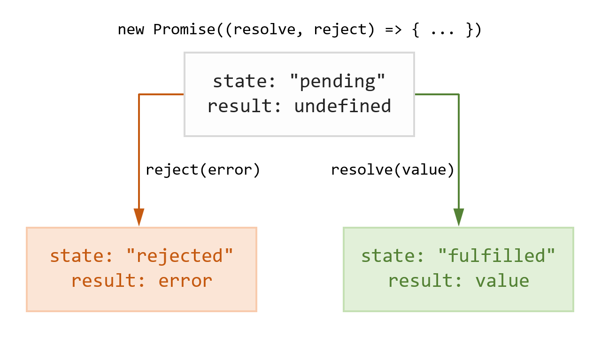

### API

API (англ. **_Application Programming Interface_** — программный интерфейс приложения) — это набор способов и правил, по которым различные программы общаются между собой и обмениваются данными.
**Почему API называют интерфейсом**
Интерфейс — это граница между двумя функциональными системами, на которой происходит их взаимодействие и обмен информацией. Но при этом процессы внутри каждой из систем скрыты друг от друга.
С помощью интерфейса можно использовать возможности разных систем, не задумываясь о том, как они обрабатывают наши запросы и что у них “под капотом”. Например, чтобы позвонить, совсем не обязательно знать, как смартфон обрабатывает нажатия на тачскрин. Важно лишь, что у гаджета есть “кнопка”, всегда возвращающая одинаковый результат в ответ на определённые действия.

### IDE

Интегри́рованная среда́ разрабо́тки, ИСP (англ. **_Integrated development environment — IDE_**), также единая среда разработки, ЕСР — комплекс программных средств, используемый программистами для разработки программного обеспечения (ПО).

Среда разработки включает в себя:

- текстовый редактор(source code editor),
- Транслятор (компилятор и/или интерпретатор),
- средства автоматизации сборки( build automation tools),
- отладчик(debugger)
- Иногда содержит также средства для интеграции с системами управления версиями и разнообразные инструменты для упрощения конструирования графического интерфейса пользователя.
  Это набор инструментов, позволяющих создавать приложения. Иными словами, если говорить очень просто, то IDE – это программа, в которой создаются другие программы.
  IDE – это не специализированные текстовый редактор!
  На самом деле, это куда более сложный инструмент. Сама по себе среда разработки обычно включает в себя и специализированный текстовый редактор, «заточенный» для работы с кодом. Но для полноценного программирования этого, конечно же, недостаточно.

Требуется также наличие хотя бы компилятора и отладчика. Первый необходим для того, чтобы перевести текст программы, созданный с использованием команд, написанных на английском (обычно) языке, в машинные коды, понятные компьютеру. Отладчик же используется для нахождения и устранения ошибок, неизбежно возникающих при написании кода.

### AJAX

AJAX (**_Asynchronous Javascript and XML_**)
Oбмен данных между веб браузером и сервером в "фоновом" режиме.

- асинхронный – действие выполняется в фоне (не в основном потоке), другими словами, таким образом, что оно не мешает пользователю взаимодействовать со страницей;
- JavaScript – язык, на котором всё это делается (т.е. создание и настройка запроса, отправка его на сервер, получение ответа и его разбор, обновление страницы);
- XML – формат для хранения и передачи данных, в настоящее время вместо него чаще используется JSON, но кроме них можно использовать и другие форматы.

Основные преимущества использования AJAX:

- снижение трафика (из-за уменьшения объёма передаваемых данных между клиентом и сервером);
- уменьшение нагрузки на сервер (не нужно генерировать всю страницу, а только ту часть, которую нужно обновить);
- увеличение быстродействия и отзывчивости (нет необходимости в полной перезагрузки страницы, достаточно обновить содержимое только отдельных блоков);
- повышение интерактивности (с помощью AJAX можно сразу отображать результаты и сделать ресурс более удобным для пользования).

Взаимодействие с сервером через асинхронные запросы осуществляется посредством XHR или метода fetch().

### NPM

Это менеджер пакетов, который входит в состав Node.js(аббр. **_node package manager_**). В течение многих лет Node широко использовался разработчиками JavaScript для обмена инструментами, установки различных модулей и управления их зависимостями.

NPM - это менеджер пакетов, которые вы можете подключить в ваш проект. Например, если вы хотите, чтобы ваш проект использовал Bootstrap, вам необязательно вручную копировать все необходимые файлы с сайта Bootstrap и хранить эту библиотеку в репозитории GIT, достаточно указать в конфигурационном файле вашего проекта одной строчкой, что вам нужен Bootstrap и пакетный менеджер npm установит Bootstrap в копию вашего проекта, при этом нет нужны хранить все подобные библиотеки в репозитории GIT вашего проекта.

### Promise

По умолчанию код в JavaScript выполняется последовательно (в одном потоке, синхронно). То есть таким образом, когда каждая следующая операция ждёт завершения предыдущей.Чтобы этого избежать необходимо использовать асинхронный код. Он в отличие от синхронного выполняется в фоновом режиме и не блокирует основной поток. Т.е. код, расположенный после него выполняется сразу же, не дожидаясь его завершения.**Асинхронный код в JavaScript может быть написан разными способами**: с помощью

- обратных вызовов,
- promise (обещаний)
- ключевых слов async/await

Promise (промисы, обещания) – это специальный объект и набор методов в JavaScript для удобного написания асинхронного кода.

В отличие от обратных вызовов промисы позволяют решать асинхронные задачи значительно проще **без создания большого количества вложенностей одних функций в другие.**

Начинается процесс написания промиса с его создания. Осуществляется это с помощью конструктора, т.е. с new Promise():

```
const promise = new Promise((resolve, reject) => {
  // асинхронный код
});
```

Конструктор промиса принимает 2 аргумента, которые являются функциями. Первый аргумент обычно называют resolve, а второй – reject. Внутрь промиса помещают асинхронный код.Промис завершает своё выполнение, когда вызывается функция resolve() или reject().
Функцию resolve() вызывают обычно в том месте кода, в котором асинхронная операция должна завершиться успешно. А функцию reject() – там, где она должна завершиться с ошибкой.

#### Состояния, в которых может находиться промис:


Промис начинается с состояния ожидания (state: "pending"). Оно говорит о том, что он ещё не выполнен (результат undefined).

Промис завершается после вызова resolve() или reject(). При этом его состояние переходит соответственно в выполнено (state: "fulfilled") или отклонено (state: "rejected").

Внутрь функций resolve() или reject() можно поместить аргумент, который затем будет доступен соответственно в then() или catch().

```
// сдал ли экзамен
const passexam = true;
// промис
const result = new Promise((resolve, reject) => {
  setTimeout(() => {
    passexam ? resolve('Папа подарил 100$.') : reject('Папа не подарил 100$.');
  }, 5000);
});

result
  .then(value => {
    console.log(result);
    console.log(value);
  })
  .catch(value => {
    console.log(result);
    console.error(value);
  });
```

Методы промисов:

- then – выполняется, когда промис завершился успешно (после вызова функции resolve());
- catch – вызывается, если промис завершается ошибкой (после вызова reject());
- finally – выполняется в любом случае после завершения промиса, вне зависимости от конечного состояния.

При этом then() позволяет обработать не только успех, но и ошибку. Для этого необходимо передать функцию в качестве второго аргумента.

```
// promise – промис
promise.then(
  value => { // действия при успешном завершении промиса  },
  error => { // действия при завершении промиса с ошибкой }
);
```

**Promice.all() и Promise.race()**
Promice.all() и Promise.race() – это статические методы Promice, которые принимают на вход массив промисов и возвращают новый промис.

В случае с Promice.all() промис завершится когда завершатся все промисы в массиве.

```
const promise1 = new Promise(resolve => setTimeout(resolve, 1000, 'one'));
const promise2 = new Promise(resolve => setTimeout(resolve, 2000, 'two'));
const promise3 = new Promise(resolve => setTimeout(resolve, 3000, 'three'));

Promise.all([promise1, promise2, promise3]).then(value => console.log(value)); // ['one', 'two', 'three']
```

### WebPack

Webpack — **это инструмент, позволяющий скомпилировать, например, JavaScript модули в единый JS-файл. Webpack также известен как сборщик модулей.**

При большом количестве файлов он создает один объемный файл (или несколько файлов) для запуска вашего приложения.

Он также способен выполнять множество иных операций:

- помогает собрать воедино ваши ресурсы
- следит за изменениями и повторно выполняет задачи
- может выполнить транспиляцию JavaScript следующего поколения до более старого стандарта JavaScript (ES5) с помощью Babel, что позволит использовать новейшие функции JavaScript, не беспокоясь о том, поддерживает их браузер или нет
- может выполнить транспиляцию CoffeeScript в JavaScript
- может конвертировать встроенные изображения в data:URI
- позволяет использовать require() для CSS файлов
- может запустить webpack-dev-server (в нём встроен локальный сервер и livereload (“живая перезагрузка браузера”))
- может работать с Hot Module Replacement (замена горячего модуля)
- может разделить выходной файл (output file) на несколько файлов, чтобы избежать медленной загрузки страницы из-за большого размера JS-файла
- может выполнить Tree Shaking

## Bundler

Бандлер — **программа, которая упаковывает сложный проект со многими файлами и внешними зависимостями в один (иногда несколько) файл, который будет отправлен браузеру.**

Самый популярный бандлер — Webpack, он используется в сложных проектах с высокими требованиями к конфигурируемости. Самый простой в использовании — Parcel, он хорошо подходит для небольших проектов без особенных требований.

## Task Runner

Есть определенные задачи, которые часто просят выполнить интерфейсных разработчиков. Такие задачи, как:

- Скомпилирование файлов SASS или LESS для создания файлов CSS
- Сжатие файлов CSS
- Минимизация JS
- Минимизация файлов HTML / JSON
- Оптимизация изображения
- Модульное тестирование
- SVN commit
- Сборка развертывание и т. Д
  Для выполнения вышеуказанных задач нам нужно так много разных надежных инструментов, и найти такие типы надежных инструментов.
  Что, если эти задачи можно автоматизировать и выполнить одним нажатием клавиши?
  Итак, что такое Task Runner? Мы можем сказать, что **Task Runner - это автоматизация одним словом.Task Runner-ы помогают нам автоматизировать эти задачи и выполнять их синхронно или асинхронно.**

## DOM

DOM (аббревиатура от Document Object Model) — **способ представления структурного документа с помощью объектов.** Это кроссплатформенное и языко-независимое соглашение для представления и взаимодействия с данными в HTML, XML и т.д.

Веб-браузеры обрабатывают составляющие DOM, и мы можем взаимодействовать с ними, используя JavaScript и CSS. Мы можем работать с узлами документа, изменять их данные, удалять и вставлять новые узлы. В наши дни DOM API является практически кроссплатформенным и кроссбраузерным.

Главная проблема DOM — он никогда не был рассчитан для создания динамического пользовательского интерфейса (UI). Мы можем работать с ним, используя JavaScript и библиотеки наподобие jQuery, но их использование не решает проблем с производительностью.
Посмотрите на современные социальные сети, такие как Twitter, Facebook или Pinterest.
После небольшого скроллинга, мы будем иметь десятки тысяч DOM-узлов, эффективно взаимодействовать с которыми — задача не из легких.

## Virtual DOM

**Virtual DOM — это техника и набор библиотек / алгоритмов, которые позволяют нам улучшить производительность на клиентской стороне, избегая прямой работы с DOM путем работы с легким JavaScript-объектом, имитирующем DOM-дерево.**

Вместо того, чтобы взаимодействовать с DOM напрямую, мы работаем с его легковесной копией. Мы можем вносить изменения в копию, исходя из наших потребностей, а после этого применять изменения к реальному DOM.
При этом происходит сравнение DOM-дерева с его виртуальной копией, определяется разница и запускается перерисовка того, что было изменено.

Такой подход работает быстрее, потому как не включает в себя все тяжеловесные части реального DOM.
Но только если мы делаем это правильно. Есть две проблемы: когда именно делать повторную перерисовку DOM и как это сделать эффективно.

## React

React JS — **это JavaScript-библиотека, разработанная в Facebook для создания пользовательских интерфейсов, которая популяризировала идею использования виртуального DOM.** React создает легковесное дерево из JavaScript-объектов для имитации DOM-дерева. Затем он создает из них HTML, который вставляется или добавляется к нужному DOM-элементу, что вызывает перерисовку страницы в браузере.
React — это библиотека, а не фреймворк, поэтому сравнивать его с Angular или Ember некорректно.

## JSX

JSX (JavaScript Syntax Extension-расширение синтаксиса JavaScript, иногда называемое JavaScript XML) - это расширение React к синтаксису языка JavaScript, которое обеспечивает способ структурирования рендеринга компонентов.

##### Встраивание выражений в JSX

В следующем примере мы объявляем переменную name и затем используем её внутри JSX, обрамляя фигурными скобками:

```
const name = 'Иван-Царевич';
const element = <h1>Здравствуй, {name}!</h1>;
```

JSX допускает использование любых корректных JavaScript-выражений внутри фигурных скобок. Например, 2 + 2, user.firstName и formatName(user) являются допустимыми выражениями.

В примере ниже мы встраиваем результат вызова JavaScript-функции formatName(user) в элемент:

```
function formatName(user) {
  return user.firstName + ' ' + user.lastName;
}

const user = {
  firstName: 'Марья',
  lastName: 'Моревна'
};

const element = (
  <h1>
    Здравствуй, {formatName(user)}!
  </h1>
);
```

##### JSX это тоже выражение

После компиляции каждое JSX-выражение становится обычным вызовом JavaScript-функции, результат которого — объект JavaScript.
Из этого следует, что JSX можно использовать внутри инструкций if и циклов for, присваивать переменным, передавать функции в качестве аргумента и возвращать из функции.

```
function getGreeting(user) {
  if (user) {
    return <h1>Здравствуй, {formatName(user)}!</h1>;
  }
  return <h1>Здравствуй, незнакомец.</h1>;
}
```

Предупреждение:

Поскольку JSX ближе к JavaScript чем к HTML, React DOM использует стиль именования camelCase для свойств вместо обычных имён HTML-атрибутов.

Например, class становится className в JSX, а tabindex становится tabIndex.

##### Использование дочерних элементов в JSX

Если тег пуст, то его можно сразу же закрыть с помощью /> точно так же, как и в XML:

```
const element = ;
```

Но JSX-теги могут и содержать дочерние элементы:

```
const element = (
  <div>
    <h1>Здравствуйте!</h1>
    <h2>Рады вас видеть.</h2>
  </div>
);
```

## Components in React

Компоненты позволяют разбить интерфейс на независимые части, про которые легко думать в отдельности. Их можно складывать вместе и использовать несколько раз.

- Функциональные компоненты:

```f
function Welcome(props) {
  return <h1>Привет, {props.name}</h1>;
}
```

Эта функция — компонент, потому что она получает данные в одном объекте («пропсы») в качестве параметра и возвращает React-элемент. Мы будем называть такие компоненты «функциональными», так как они буквально являются функциями.

- классовые компоненты:

```
class Welcome extends React.Component {
  render() {
    return <h1>Привет, {this.props.name}</h1>;
  }
}
```

С точки зрения React, эти два компонента эквивалентны.

##### Как отрендерить компонент

элементы могут описывать и наши собственные компоненты:
`const element = <Welcome name="Алиса" />;`

Когда React встречает подобный элемент, он собирает все JSX-атрибуты и дочерние элементы в один объект и передаёт их нашему компоненту. Этот объект называется «пропсы» (props).

```
function Welcome(props) {
  return <h1>Привет, {props.name}</h1>;
}

const root = ReactDOM.createRoot(document.getElementById('root'));
const element = <Welcome name="Алиса" />;
root.render(element);
```

Например, этот компонент выведет «Привет, Алиса» на страницу

#### Извлечение компонентов

```
function Comment(props) {
  return (
    <div className="Comment">
      <div className="UserInfo">
        
        <div className="UserInfo-name">
          {props.author.name}
        </div>
      </div>
      <div className="Comment-text">
        {props.text}
      </div>
      <div className="Comment-date">
        {formatDate(props.date)}
      </div>
    </div>
  );
}
```

Для начала извлечём Avatar:

```
function Avatar(props) {
  return (
    
  );
}
```

Компоненту Avatar незачем знать, что он рендерится внутри Comment. Поэтому мы дали его пропу чуть менее конкретное имя — user, а не author.

**Пропсы следует называть так, чтобы они имели смысл в первую очередь с точки зрения самого компонента, а уже во вторую тех компонентов, которые его рендерят.**

Теперь можно немножко упростить наш Comment:

```
function Comment(props) {
  return (
    <div className="Comment">
      <div className="UserInfo">
        <Avatar user={props.author} />
        <div className="UserInfo-name">
          {props.author.name}
        </div>
      </div>
      <div className="Comment-text">
        {props.text}
      </div>
      <div className="Comment-date">
        {formatDate(props.date)}
      </div>
    </div>
  );
}
```

#### Пропсы можно только читать

Компонент никогда не должен что-то записывать в свои пропсы — вне зависимости от того, функциональный он или классовый.

Возьмём для примера функцию sum:

```
function sum(a, b) {
  return a + b;
}
```

Такие функции называют «чистыми», потому что они не меняют свои входные данные и предсказуемо возвращают один и тот же результат для одинаковых аргументов.

А вот пример нечистой функции — она записывает данные в свои же аргументы:

```
function withdraw(account, amount) {
  account.total -= amount;
}
```
React-компоненты обязаны вести себя как чистые функции по отношению к своим пропсам.


## Pure functions
Функция должна удовлетворять двум условиям, чтобы считаться «чистой»:

— Каждый раз функция возвращает одинаковый результат, когда она вызывается с тем же набором аргументов

— Нет побочных эффектов

Возьмём для примера функцию sum:
```
function sum(a, b) {
  return a + b;
}
  
```
Такие функции называют «чистыми», потому что они не меняют свои входные данные и предсказуемо возвращают один и тот же результат для одинаковых аргументов.

А вот пример нечистой функции — она записывает данные в свои же аргументы:
```
function withdraw(account, amount) {
  account.total -= amount;
}
```
- Функция чистая, если не имеет побочных эффектов и каждый раз возвращает одинаковый результат, когда она вызывается с тем же набором аргументов.
- Побочные эффекты включают: меняющийся вход, HTTP-вызовы, запись на диск, вывод на экран.
- Вы можете безопасно клонировать, а затем менять входные параметры. Просто оставьте оригинал без изменений.
- Синтаксис распространения (… syntax) — это самый простой способ клонирования объектов и массивов.